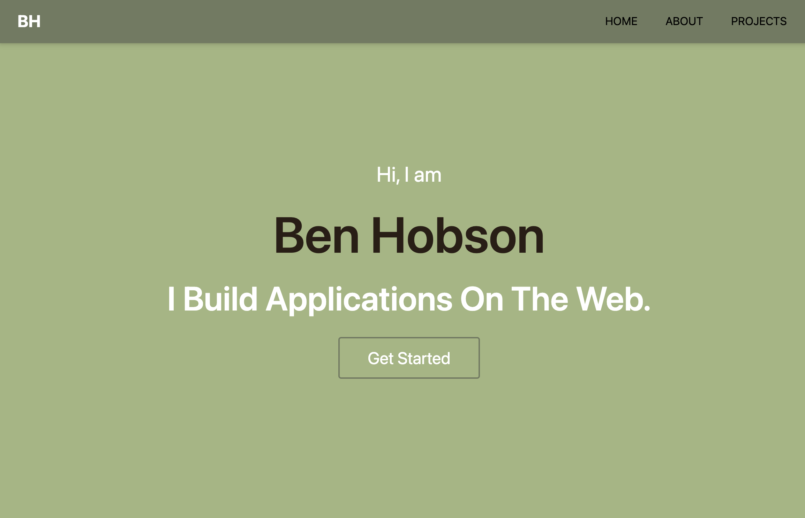

# BenHobson_Portfolio

## Description

I built this portfolio using React. It showcases some of the skills I have learned during my experience in the UCLA coding bootcamp, while also displaying a few other projects I have created while participating in this course. This portfolio is styled using TailwindCSS, and it is structured by rendering the different pages and components depending on which route is currently in use.

## Installation

This Project is deployed on Heroku, so to use it you only need to follow the link below.

https://benhobson-portfolio.herokuapp.com/

## Screenshot

